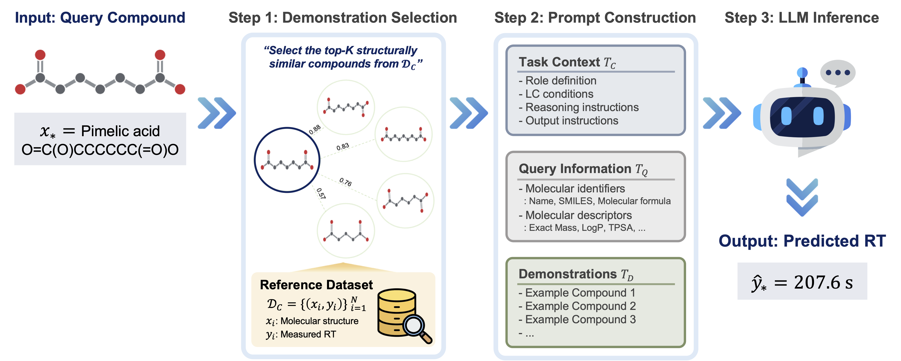

<div align="center">
<h1>
RT-ICL: Large Language Models Enable Training-Free Retention Time Prediction Across Chromatographic Systems
</h1>

<p>
Woojae Kim · Seokho Kang<sup>*</sup>
</p>

<sub>
Department of Industrial Engineering, Sungkyunkwan University, Suwon, Republic of Korea
</sub>

</div>

<br/>

This repository provides notebooks for data preprocessing, single-compound prediction, and dataset evaluation. RT-ICL predicts small-molecule liquid chromatography retention times (RTs) using large language models and structurally similar reference compounds. Given a query compound and LC conditions, it retrieves structurally similar reference compounds with measured RTs, builds a prompt comprising task context, query information, and demonstrations, and predicts the query compound’s RT.

<div align="center">
  
</div>

---

## Abstract

Retention time (RT) provides complementary information for compound annotation in liquid chromatography–mass spectrometry (LC-MS). The impracticality of experimentally measuring RT for every compound under each chromatographic system has motivated the development of RT prediction methods. Since the dependence of RT on chromatographic conditions limits the transferability of prediction models across different chromatographic systems, each system typically requires a separate prediction model trained on a sufficiently large RT-labeled dataset. Although transfer learning and multitask learning alleviate this difficulty, RT prediction remains challenging for chromatographic systems with scarce RT data. Here, we propose RT-ICL, a large language model (LLM)-based method that leverages in-context learning (ICL) to enable training-free RT prediction for data-scarce chromatographic systems. To predict the RT of a query compound under a target chromatographic system, we prompt the LLM with task instructions and LC conditions for the target system, molecular information about the query compound, and structurally similar reference compounds with RTs measured from the same system. This method can be applied to different chromatographic systems without requiring task-specific fine-tuning. We demonstrate that the proposed method achieves performance superior or comparable to that of transfer learning and multitask learning baselines on various data-scarce chromatographic systems.

---

## Data and Preprocessing

The data are derived from [RepoRT](https://github.com/michaelwitting/RepoRT), described by [Kretschmer et al., Nature Methods (2024)](https://doi.org/10.1038/s41592-023-02143-z).

RT-ICL uses a subset of 10 datasets selected from RepoRT and preprocessed by this project. The input data are stored in [`data/raw/`](data/raw/), organized by dataset ID. Each dataset directory contains RT measurements (`*_rtdata.tsv`), source metadata (`*_info.tsv`), and LC conditions (`*_lc_condition.yaml`). Dataset sources and links to the corresponding RepoRT metadata are listed in [`data/source.tsv`](data/source.tsv).

Run [01_preprocess.ipynb](01_preprocess.ipynb) to generate the processed data under `data/processed/<dataset_id>/`. Each output directory contains compound attributes with RTs in seconds, LC conditions, and a preprocessing report.

RepoRT-derived data remain subject to [CC BY-SA 4.0](https://creativecommons.org/licenses/by-sa/4.0/); see the [RepoRT license](https://github.com/michaelwitting/RepoRT/blob/master/LICENSE).

---

## Installation

Run the following from the repository root:

```bash
conda create -n rt_icl python=3.11 -y
conda activate rt_icl
python -m pip install -r requirements.txt
python -m ipykernel install --user --name rt_icl --display-name "Python (RT-ICL)"
```

---

## Quick Start

Open the notebooks below from the repository root, select the `Python (RT-ICL)` kernel, and run the cells from top to bottom.

### Step 1. Prepare the data

Run [01_preprocess.ipynb](01_preprocess.ipynb) to generate `data/processed/`. No API key is needed. Set `OVERWRITE = True` to rebuild existing files.

---

### Step 2. Set API keys

In the `.env` file, add the API key for your chosen provider:

```dotenv
GOOGLE_API_KEY=
OPENAI_API_KEY=
OPENROUTER_API_KEY=
```

API usage may incur charges.

---

### Step 3. Run prediction or evaluation

Set the dataset IDs, `PROVIDER`, and `MODEL` in either notebook. After preprocessing, the two notebooks can be run independently.

- [02_predict_compound.ipynb](02_predict_compound.ipynb): Predict a single compound's RT and compare it with the measured RT.
- [03_predict_dataset.ipynb](03_predict_dataset.ipynb): Evaluate a dataset using 10-fold cross-validation.

Configured models:

| `PROVIDER` | `MODEL` |
|---|---|
| `gemini` | `gemini-3-flash-preview` |
| `openai` | `gpt-5.4-mini-2026-03-17` |
| `openrouter` | `qwen/qwen3-235b-a22b-2507` |
| `openrouter` | `openai/gpt-oss-120b` |

For all datasets, set `DATASET_IDS = list(DEFAULT_DATASETS)` in the dataset notebook. Adjust `MAX_CONCURRENT` to suit your API limits.

---

### Step 4. View results

Results are saved under `results/compound/` or `results/dataset/`:

| File | Contents |
|---|---|
| `run_metadata.json` | Run settings and model configuration |
| `metrics.json` | Evaluation metrics, prediction runtime, and available token usage |
| `predictions.csv` | Measured and predicted RTs (seconds), errors, and model responses |

Metrics include MAE (s), median absolute error (s), MAPE (%), and R². To repeat a run, choose a new `RESULTS_DIR`; existing results are not overwritten.

---

## Project Structure

```text
RT_ICL/
├── 01_preprocess.ipynb
├── 02_predict_compound.ipynb
├── 03_predict_dataset.ipynb
├── data/
│   ├── raw/
│   ├── processed/
│   └── source.tsv
├── rt_icl/
│   ├── config.py
│   ├── data.py
│   ├── preprocessing.py
│   ├── descriptors.py
│   ├── retrieval.py
│   ├── prompt.py
│   ├── prompts/
│   ├── pipeline.py
│   ├── evaluation.py
│   └── providers/
├── results/
├── .env.example
└── requirements.txt
```

<!-- ## Citation -->

---
